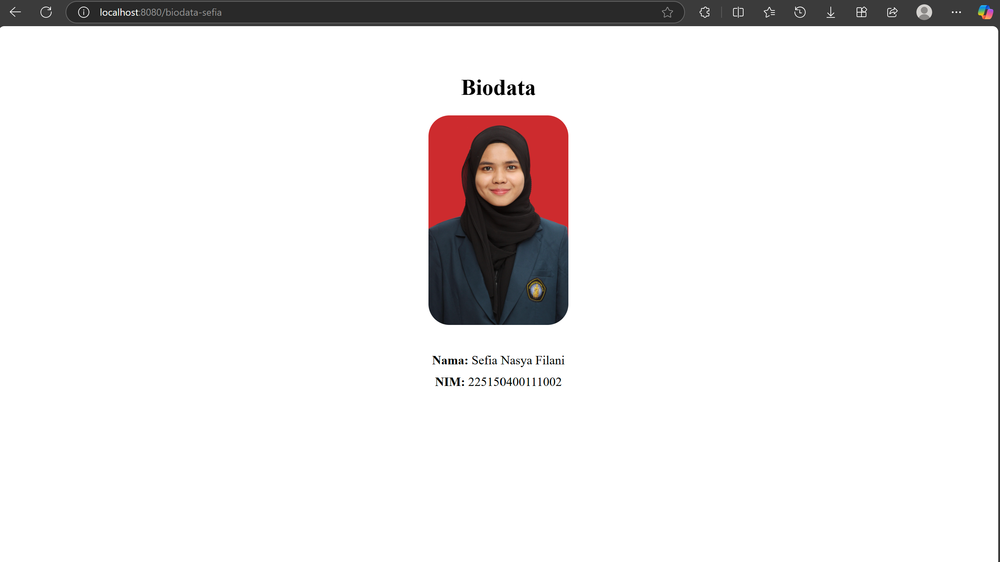

# 🎓 Vue Biodata App – Tugas Pemrograman Web

Aplikasi sederhana berbasis Vue.js yang menampilkan halaman biodata. Proyek ini dibuat sebagai bagian dari tugas mata kuliah **Pemrograman Web Lanjut** di Fakultas Ilmu Komputer, Universitas Brawijaya.

## 📍 URL Halaman

Akses biodata pada: http://localhost:8080/biodata

## 📸 Tampilan Aplikasi

## 📂 Struktur Proyek
src/ ├── assets/ │ └── foto.jpg ├── views/ │ └── Biodata.vue ├── router/ │ └── index.js ├── App.vue └── main.js

## 👤 Biodata

- **Nama:** Sefia Nasya Filani  
- **NIM:** 225150400111002 

## 🚀 Cara Menjalankan

1. Clone repository:
git clone https://github.com/username/biodata-project.git
cd biodata-project

2. Install dependencies:
npm install

3. Jalankan server:
npm run serve

4. Buka di browser:
http://localhost:8080/biodata
